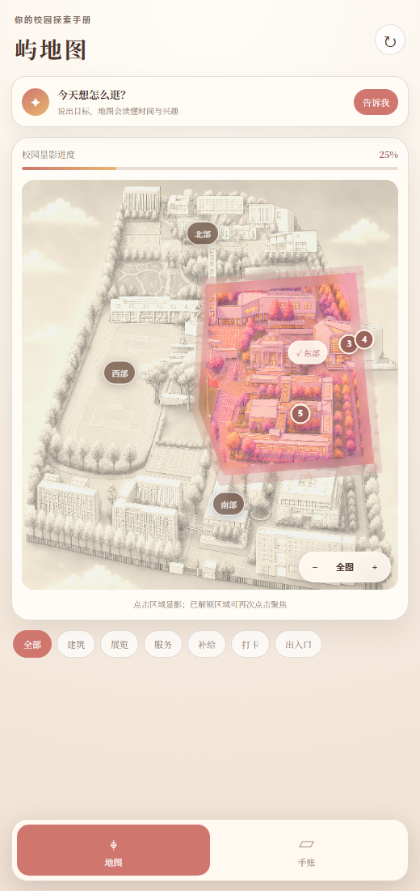
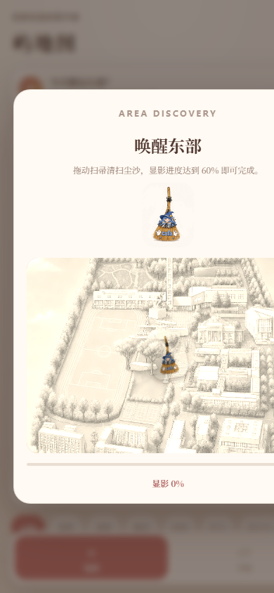
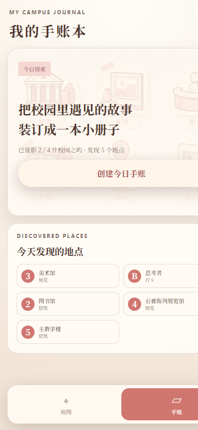
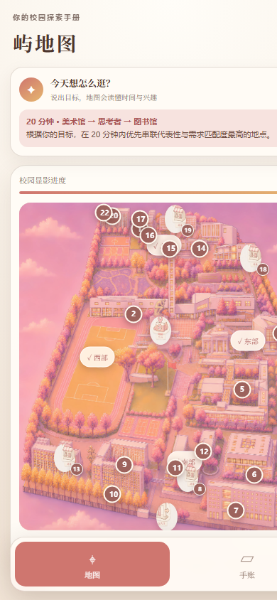

# 屿地图

> AI时代，连接空间、展览与记忆，让每一次校园探索都值得被珍藏。

屿地图是一款面向中央美术学院花家地校区的移动端视觉探索图鉴。用户通过清扫尘沙逐步显影校园区域，发现建筑、展览、服务与文化地标；同时可以直接表达目标，让系统根据时间与兴趣组织一条可解释的探索路线。

**在线体验：** https://luyududu-bot.github.io/yuditu/

## 界面预览

| 局部显影 | 扫帚唤醒 | 手账入口 | 完整图鉴 |
| --- | --- | --- | --- |
|  |  |  |  |

## 核心体验

- 四个校园区域可按任意顺序局部显影；柔边笔刷与飞沙颗粒增强清扫反馈，区域显色沿真实轮廓自然融入地图。
- 解锁区域后，结构化地点对象逐步出现并可查看详情。
- 建筑使用权威编号，补给、打卡、出入口等设施使用定制视觉图标。
- 地图首屏与底部导航均可进入 DIY 手账编辑器。
- 移动端单页活页手账会根据已发现地点自动生成校园回忆；用户可从底部素材抽屉添加独立贴纸、地点、文字与照片，自由拖动、缩放、旋转和调整层级，并导出 PNG 保存或分享。
- 支持按建筑、展览、补给、打卡、出入口筛选。
- 用户可表达“我只有 20 分钟，想看最有代表性的地方”等目标。
- 本地目标解析器读取地点语义、时间约束和代表性分数，生成可解释路线。

## AI Native 设计

屿地图没有把 AI 做成附加聊天框，而是先把校园转化为 AI 可理解、可组合、可调用的对象系统。每个地点具备：

- `type` / `category` / `tags`
- `relations`
- `actions`
- `constraints`
- `metadata`

未来平台级 Agent 可以读取这些对象，理解用户目标，并调用受控 action 聚焦地点、生成路线或创建探索记录。

## 本地运行

```bash
npm start
```

访问 `http://localhost:4173`。

运行测试：

```bash
npm test
```

## 团队分工

- **卢钰｜代码与产品实现：** 前端开发、结构化对象系统、目标路线能力、部署与技术文档。
- **王乐｜视觉与体验设计：** 地图视觉、扫帚与贴纸素材、界面风格、探索叙事与展示设计。

## 商业逻辑

屿地图以学校、展览主办方和文化园区为服务对象，提供定制化视觉导览与内容运营服务；访客免费使用。对象系统和目标路线能力可复制到其他艺术院校、博物馆与文化园区，手账分享、限定贴纸和联名文创则承担传播与增值。

## 技术说明

首版使用零依赖静态 Web 技术实现，便于快速部署与稳定演示。核心数据与目标路线逻辑位于 `src/data.mjs` 和 `src/core.mjs`；用户解锁进度与手账排版使用 `localStorage` 保存，手账通过 Canvas 导出为 PNG。
